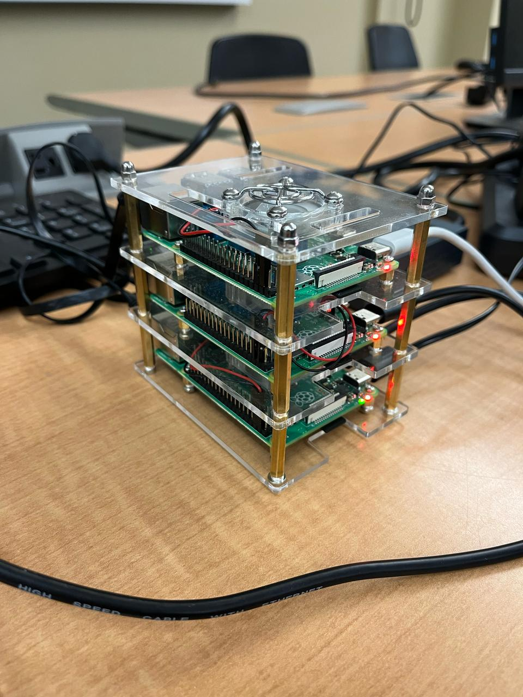

# PiEdge Cloud: OpenStream

A cloud-based real-time video streaming and distributed computing platform built on a scalable Raspberry Pi cluster. This project is developed for CMPE 246 at UBC Okanagan and integrates edge computing, machine learning, and web development technologies.

## 📦 Project Structure

## 🧠 Core Features

- **Raspberry Pi Cluster (3 Nodes)**
  - Master node runs Kubernetes (K3s) for container orchestration  
  - High-speed Gigabit networking for distributed communication

- **Wireless Video Capture & Processing**
  - A Pi with Camera Module 3 streams video to the cluster  
  - Real-time ML tasks: face/object detection using TensorFlow

- **Web Streaming Application**
  - Built with Next.js (React + TypeScript) and Node.js backend  
  - Live video feed and event-based messaging overlay

- **Database Integration**
  - Prisma ORM with MongoDB for real-time and persistent data  
  - Scalable design for future multi-user features

- **Design Patterns Used**
  - Singleton (master node), Factory (node scaling), Strategy (ML models), Observer (stream updates), MVC (web app), Adapter (protocols)

---

## 📄 Documentation

This repository maintains comprehensive documentation to support developers and stakeholders. The documentation covers setup instructions, architectural details, application usage, and project timelines. It is organized into several key documents and resources:

- **README.md:**  
  Main documentation outlining the project overview, setup, and configuration.
  
- **MLThing_README.md:**  
  Detailed instructions related to the machine learning components.
  
- **OpenStream_README.md:**  
  Core documentation for the web streaming application and related services.
  
- **Timeline_README.md:**  
  A timeline and milestone guide detailing our Agile sprints and project roadmap.
  
- **Images and Diagrams:**  
  The [`images/`](images/) folder contains UML diagrams, architecture schematics, and other visual assets that support understanding of the project structure and system design.

For quick access, please refer to the following links:  
- [MLThing_README.md](https://github.com/superbolt08/OpenStream/blob/main/MLThing_README.md)  
- [OpenStream_README.md](https://github.com/superbolt08/OpenStream/blob/main/OpenStream_README.md)  
- [Timeline_README.md](https://github.com/superbolt08/OpenStream/blob/main/Timeline_README.md)

---

## 👥 Team Members

| **Name**         | **Role**                                                                                     |
|------------------|----------------------------------------------------------------------------------------------|
| Patrick Agnimel  | Team Lead – Responsible for quality assurance, documentation, and website development.       |
| Johan Gonzaga    | Lead Machine Learning Developer – Integrates TensorFlow and Python-based distributed algorithms.|
| Syed Saad Ali    | Project Manager & System Architecture Lead – Coordinates hardware, networking, and software integration. |
| Michael Zhang    | Web Development Team – Assists with frontend/backend development and database integration.    |
| Algernon Ren     | Infrastructure & Hardware Assembly Specialist – Oversees Raspberry Pi cluster setup and networking. |
| Jia Yi Lu        | Operations & Maintenance Coordinator – Manages version control, CI/CD pipeline, and documentation upkeep. |

---

## 🤝 Communication and Collaboration

- **Primary Communication Tools:**
  - Discord chat group for day-to-day communication.
  - Email for formal or long-form communications.
  - Discord video calls for online meetings.

- **Document Collaboration:**
  - Google Docs for real-time collaborative work on reports and meeting notes.
  - GitHub Repository for documentation.

- **Version Control and Task Tracking:**
  - Git and GitHub for version control.
  - GitHub Actions for CI/CD and automation.
  - Kanban board and GitHub Projects for task tracking and progress monitoring.

- **Meeting Schedule:**
  - Daily scrum meetings (time TBD) to discuss progress and challenges.
  - Weekly sprint meetings every Sunday from 1 PM to 3 PM (in person).
  - Weekly sub-meetings during CMPE 246 Lab sessions.

---

## 🚀 Getting Started

### Prerequisites

- Raspberry Pi 4 (x8 recommended)
- Camera Module 3 (1 unit)
- Gigabit Ethernet switch
- NVMe SSD (optional for master node)
- Docker & Kubernetes (K3s)
- Node.js + Yarn/NPM
- WSL
- Docker Desktop

---

## 📊 Architecture

- **Cluster:** Raspberry Pi 4 nodes connected via a switch, managed with Kubernetes (K3s).  
- **Streaming:** WebRTC feeds processed in parallel.  
- **Web App:** User-friendly interface with dynamic video and event overlays.  
- **ML Tasks:** TensorFlow models for object recognition, adaptable using the Strategy pattern.

---

## 🛠️ Tech Stack

- **Frontend:** Next.js, React
- **Backend:** Node.js, Express, TypeScript
- **ML:** TensorFlow, Python
- **Database:** Prisma, MongoDB
- **Containerization:** Docker, Kubernetes (K3s)

---

## 🚀 Application of the Project

The PiEdge Cloud platform addresses several practical use cases by leveraging a low-cost, scalable Raspberry Pi cluster. Key applications include:

- **Real-Time Video Streaming:**  
  Deliver live video feeds for remote monitoring, educational or entertainment broadcasts, and public safety applications with minimal latency.

- **Edge Computing:**  
  Process data closer to its source to reduce latency and improve responsiveness in IoT deployments, smart surveillance, and emergency response systems.

- **Distributed Machine Learning:**  
  Enable real-time object detection, face recognition, and data analysis by distributing machine learning tasks across multiple nodes.

- **Cost-Effective Cloud Alternatives:**  
  Provide a budget-friendly cloud platform for small businesses, educational institutions, and research organizations unable to afford traditional data centers.

- **Scalable Research & Development:**  
  Offer a modular environment for prototyping and testing new algorithms in distributed computing, video processing, and real-time analytics.

---

## 📚 References

- [Kubernetes K3s Docs](https://docs.k3s.io)
- [TensorFlow](https://www.tensorflow.org/)
- [Raspberry Pi Clustering Tutorial](https://www.raspberrypi.com/tutorials/cluster-raspberry-pi-tutorial/)
- [Docker Swarm Setup](https://docs.docker.com/engine/swarm/)
- 🌐 [Public Website Repository](https://github.com/superbolt08/OpenStream)
- 📽️ [Demo Video](http://www.youtube.com/watch?v=guBMEs41JM0)

---

## 🗂️ Directory Structure

### `app/`
- Website application, including frontend and backend code.

### `prisma/`
- Prisma ORM configuration and schema definitions for interacting with the MongoDB database.

### `stream-server/`
- Code/config for the video streaming server component.

### `ml-server/`
- Machine learning server for processing video data via API requests.

### `websocket/`
- WebSocket server responsible for real-time chat and stream-related communication.

---

## ⚙️ Configuration Files

### `.example.env.development`
- Example environment variable files for development and testing.

### `Dockerfile`
- Docker configuration for building the project container image and container.

### `docker-compose.yaml`
- Defines services, volumes, and networks to run the full application stack locally using Docker Compose.

---

## ✅ Submission Checklist

- [x] Midterm proposal PDF
- [x] Final presentation PDF
- [x] UML diagrams (included in final presentation)
- [x] Source code (web & ML)
- [x] Demo video
- [x] README documentation

---

## 📄 License

This project is developed as part of a university course and is not licensed for commercial distribution.

---

📷 Powered by Raspberry Pi  
⚡ Fueled by curiosity and collaboration
